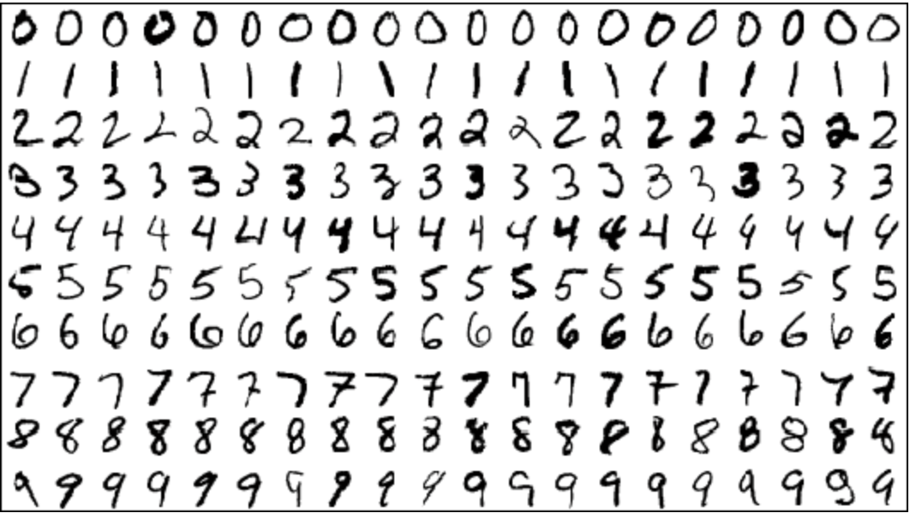

# Number-Guesser
A program that will predict what number you have drawn.

The program uses a MNIST dataset containing 60,000 images of handwritten digits.

### The predictions may not be extremely accurate due to the style of written digits in a dataset.

Here are sample digits from the dataset that model was trained on:

